# Deployment Pipeline Features

## Quick Start

This document provides a quick overview of the deployment pipeline features implemented for Paperlyte.

## 🚀 Features Overview

### 1. Blue-Green Deployment

**Workflow:** `.github/workflows/deploy-blue-green.yml`

Zero-downtime deployments with automatic health checks and easy rollback.

**How to use:**

```bash
# Via GitHub Actions UI
1. Navigate to Actions → Blue-Green Deployment
2. Click "Run workflow"
3. Select environment (staging/production)
4. Choose deployment type
5. Enable/disable auto-switch
```

**Benefits:**

- Zero downtime during deployments
- Safe testing of new versions
- Instant rollback capability
- Automated health verification

### 2. Automated Rollback

**Workflow:** `.github/workflows/rollback.yml`

Quick and safe rollback to previous deployments.

**When to use:**

- Critical bugs in production
- Performance issues
- Security vulnerabilities
- Failed deployments

**How to rollback:**

```bash
1. Go to Actions → Rollback Deployment
2. Click "Run workflow"
3. Select environment
4. Choose "previous" or specific commit SHA
5. Provide reason
6. Confirm
```

### 3. Health Checks

**Workflow:** `.github/workflows/post-deploy-health-check.yml`

Automated deployment verification after every deployment.

**Checks performed:**

- ✅ HTTP status verification
- ✅ Response time monitoring
- ✅ Critical assets validation
- ✅ SSL certificate verification
- ✅ Content integrity checks

**Health endpoint:**

```javascript
// In browser console
window.__paperlyte_health()
// Returns: { status, version, timestamp, checks, environment }
```

### 4. Database Migrations

**Location:** `src/migrations/`

Automated schema migrations for data evolution.

**Current state:**

- localStorage-based migrations
- Version tracking
- Rollback support
- Prepared for Q4 2025 API migration

**Creating migrations:**

```typescript
// src/migrations/002-example.ts
export const migration002: Migration = {
  version: 2,
  name: 'add-feature',
  description: 'Add new feature to data',
  async up() {
    // Forward migration
  },
  async down() {
    // Rollback
  },
}
```

## 📋 Deployment Workflows

### Standard Deployment

```mermaid
graph LR
    A[Push to main] --> B[Build]
    B --> C[Deploy to Staging]
    C --> D[Health Check]
    D --> E[✅ Live]
```



### Blue-Green Deployment


### Rollback Process

```mermaid
graph LR
    A[Issue Detected] --> B[Trigger Rollback]
    B --> C[Deploy Previous Version]
    C --> D[Health Check]
    D --> E[✅ Restored]
```



## 🔧 Configuration

### Required Secrets

```bash
# Netlify (Required)
NETLIFY_AUTH_TOKEN
NETLIFY_STAGING_SITE_ID
NETLIFY_PROD_SITE_ID

# Analytics (Optional)
VITE_POSTHOG_API_KEY_STAGING
VITE_POSTHOG_API_KEY_PROD

# Monitoring (Optional)
VITE_SENTRY_DSN_STAGING
VITE_SENTRY_DSN_PROD
```

### Setup Script

```bash
# Interactive setup
./scripts/setup-deployment.sh
```

## 📊 Monitoring

### Post-Deployment

After each deployment:

1. Health checks run automatically
2. Results posted to GitHub Actions
3. Alerts on failures
4. Deployment summary generated

### Manual Verification

```bash
# Check health status
curl https://your-deployment-url.com

# View health endpoint (in browser console)
window.__paperlyte_health()

# Check logs
# GitHub Actions → Latest workflow run
```

## 🎯 Best Practices

### Before Deployment

- ✅ Test thoroughly in staging
- ✅ Run full CI pipeline locally
- ✅ Review changes
- ✅ Check for breaking changes

### During Deployment

- ✅ Monitor workflow logs
- ✅ Watch health checks
- ✅ Be ready to rollback

### After Deployment

- ✅ Verify critical features
- ✅ Monitor error rates (Sentry)
- ✅ Check analytics (PostHog)
- ✅ Document any issues

## 📚 Documentation

- [Deployment Pipeline](./deployment-pipeline.md) - Comprehensive guide
- [Deployment Setup](./deployment-setup.md) - Initial setup
- [CI/CD Status](./CI-CD-STATUS.md) - Infrastructure overview

## 🚨 Emergency Procedures

### Production Down

```bash
1. Assess the issue
2. Trigger rollback immediately
3. Investigate root cause
4. Create incident report
5. Plan fix and re-deployment
```

### Rollback Failed

```bash
1. Check workflow logs
2. Attempt manual deployment
3. Contact DevOps team
4. Escalate if needed
```

## 💡 Tips

- **Test in staging first** - Always validate in staging before production
- **Use blue-green for major changes** - Reduces risk for significant updates
- **Monitor after deployment** - Watch metrics for at least 30 minutes
- **Document incidents** - Create issues for production problems
- **Keep rollback ready** - Previous version always available

## 🔗 Quick Links

- [GitHub Actions](https://github.com/shazzar00ni/paperlyte/actions)
- [Netlify Dashboard](https://app.netlify.com)
- [Sentry Dashboard](https://sentry.io)
- [PostHog Dashboard](https://app.posthog.com)

## 📞 Support

For deployment issues:

1. Check workflow logs in GitHub Actions
2. Review [deployment-pipeline.md](./deployment-pipeline.md)
3. Search existing GitHub issues
4. Create new issue with details
5. Contact team via discussions

---

**Last Updated:** 2025-10-31
**Status:** ✅ All systems operational
